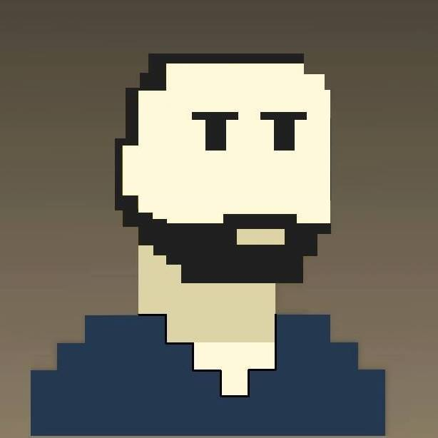

# Olá, seja bem vindo ao meu GitHub! 

## Quem sou eu

  

Meu nome é Felipe Godoy, sou imigrante brasileiro em Portugal, entusiasta e apaixonado por tecnologia.

### Sobre mim

Atualmente estou em transição para área de TI, buscando mais especificamente cargos como DevOps ou Cloud Engineer. Tenho uma base em desenvolvimento web e uma enorme curiosidade e vontade de aprender, de maneira que a agregar conhecimento unindo praticidade para meus projetos. 

Nos últimos anos, meu foco tem sido aprofundar habilidades técnicas em ambientes Linux, automação com Python, programação em C++, infraestrutura em cloud e containers (AWS, Docker, IaC). Paralelamente, mantenho vivas minhas raízes em MMORPGs e games online, aplicando meus conhecimentos para a área.

Formalmente trabalho com suporte inbound técnico, ao mesmo tempo em que estudo essas tecnologias. Acredito que a tecnologia possui um potencial infinito e amplamente explorável — e é com essa mentalidade que construo meus projetos.

Atualmente estou num projeto pessoal que engloba todos os conhecimentos dessas áreas de tecnologia e desenvolvimento em um projeto só: um servidor MMORPG. 

Aqui você vai encontrar os bastidores dessa jornada: automações, experimentos técnicos e provas de que a curiosidade pode se transformar e impactar de alguma maneira útil.

 

  
  
   
  

  
### Minhas habilidades

 

  
    &nbsp;&nbsp;&nbsp;&nbsp;&nbsp;&nbsp;&nbsp;&nbsp;&nbsp;&nbsp;&nbsp;&nbsp;&nbsp;
      
    &nbsp;&nbsp;&nbsp;&nbsp;&nbsp;&nbsp;&nbsp;&nbsp;&nbsp;&nbsp;&nbsp;&nbsp;&nbsp;
    
    &nbsp;&nbsp;&nbsp;&nbsp;&nbsp;&nbsp;&nbsp;&nbsp;&nbsp;&nbsp;&nbsp;&nbsp;&nbsp;
      
    &nbsp;&nbsp;&nbsp;&nbsp;&nbsp;&nbsp;&nbsp;&nbsp;&nbsp;&nbsp;&nbsp;&nbsp;&nbsp;
    
     &nbsp;&nbsp;&nbsp;&nbsp;&nbsp;&nbsp;&nbsp;&nbsp;&nbsp;&nbsp;&nbsp;&nbsp;&nbsp;
    
    &nbsp;&nbsp;&nbsp;&nbsp;&nbsp;&nbsp;&nbsp;&nbsp;&nbsp;&nbsp;&nbsp;&nbsp;&nbsp;
     
      &nbsp;&nbsp;&nbsp;&nbsp;&nbsp;&nbsp;&nbsp;&nbsp;&nbsp;&nbsp;&nbsp;&nbsp;&nbsp;
    
        &nbsp;&nbsp;&nbsp;&nbsp;&nbsp;&nbsp;&nbsp;&nbsp;&nbsp;&nbsp;&nbsp;&nbsp;&nbsp;
    
        &nbsp;&nbsp;&nbsp;&nbsp;&nbsp;&nbsp;&nbsp;&nbsp;&nbsp;&nbsp;&nbsp;&nbsp;&nbsp;

 
 

### Contato

  
  

  
### Total de visitas no meu perfil :detective:  
 
 
   
 

<!---
FelipeGodoy96/FelipeGodoy96 is a ✨ special ✨ repository because its `README.md` (this file) appears on your GitHub profile.
You can click the Preview link to take a look at your changes.
--->
